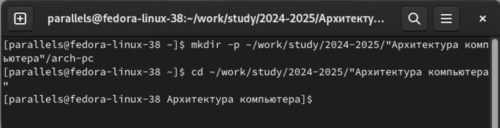

---
## Front matter
title: "Отчёт по лабораторной работе №2"
subtitle: "Дисциплина: архитектура компьютера"
author: "Челухаев Кирилл Александрович"

## Generic otions
lang: ru-RU
toc-title: "Содержание"

## Bibliography
bibliography: bib/cite.bib
csl: pandoc/csl/gost-r-7-0-5-2008-numeric.csl

## Pdf output format
toc: true # Table of contents
toc-depth: 2
lof: true # List of figures
lot: true # List of tables
fontsize: 12pt
linestretch: 1.5
papersize: a4
documentclass: scrreprt
## I18n polyglossia
polyglossia-lang:
  name: russian
  options:
	- spelling=modern
	- babelshorthands=true
polyglossia-otherlangs:
  name: english
## I18n babel
babel-lang: russian
babel-otherlangs: english
## Fonts
mainfont: IBM Plex Serif
romanfont: IBM Plex Serif
sansfont: IBM Plex Sans
monofont: IBM Plex Mono
mathfont: STIX Two Math
mainfontoptions: Ligatures=Common,Ligatures=TeX,Scale=0.94
romanfontoptions: Ligatures=Common,Ligatures=TeX,Scale=0.94
sansfontoptions: Ligatures=Common,Ligatures=TeX,Scale=MatchLowercase,Scale=0.94
monofontoptions: Scale=MatchLowercase,Scale=0.94,FakeStretch=0.9
mathfontoptions:
## Biblatex
biblatex: true
biblio-style: "gost-numeric"
biblatexoptions:
  - parentracker=true
  - backend=biber
  - hyperref=auto
  - language=auto
  - autolang=other*
  - citestyle=gost-numeric
## Pandoc-crossref LaTeX customization
figureTitle: "Рис."
tableTitle: "Таблица"
listingTitle: "Листинг"
lofTitle: "Список иллюстраций"
lotTitle: "Список таблиц"
lolTitle: "Листинги"
## Misc options
indent: true
header-includes:
  - \usepackage{indentfirst}
  - \usepackage{float} # keep figures where there are in the text
  - \floatplacement{figure}{H} # keep figures where there are in the text
---

# Цель работы

Целью работы является изучить идеологию и применение средств контроля версий. Приобрести практические навыки по работе с системой git.

# Задание

Настройка GitHub. Базовая настройка Git. Создание рабочего пространства и репозитория курса на основе шаблона. Создание репозитория на основе шаблона Настройка каталога курса. Задания для самостоятельной работы 

# Теоретическое введение

Системы контроля версий (Version Control System, VCS) применяются при работе нескольких человек над одним проектом. Обычно основное дерево проекта хранится в локальном или удалённом репозитории, к которому настроен доступ для участников проекта. При внесении изменений в содержание проекта система контроля версий позволяет их фиксировать, совмещать изменения, произведённые разными участниками проекта, производить откат к любой более ранней версии проекта, если это требуется. В классических системах контроля версий используется централизованная модель, предполагающая наличие единого репозитория для хранения файлов. Выполнение большинства функций по управлению версиями осуществляется специальным сервером. Участник проекта (пользователь) перед началом работы посредством определённых команд получает нужную ему версию файлов. После внесения изменений, пользователь размещает новую версию в хранилище. При этом предыдущие версии не удаляются из центрального хранилища и к ним можно вернуться в любой момент. Сервер может сохранять не полную версию изменённых файлов, а производить так называемую дельта-компрессию — сохранять только изменения между последовательными версиями, что позволяет уменьшить объём хранимых данных. Системы контроля версий поддерживают возможность отслеживания и разрешения конфликтов, которые могут возникнуть при работе нескольких человек над одним файлом. Можно объединить (слить) изменения, сделанные разными участниками (автоматически или вручную), вручную выбрать нужную версию, отменить изменения вовсе или заблокировать файлы для изменения. В зависимости от настроек блокировка не позволяет другим пользователям получить рабочую копию или препятствует изменению рабочей копии файла средствами файловой системы ОС, обеспечивая таким образом, привилегированный доступ только одному пользователю, работающему с файлом.  Системы контроля версий также могут обеспечивать дополнительные, более гибкие функциональные возможности. Например, они могут поддерживать работу с несколькими версиями одного файла, сохраняя общую историю изменений до точки ветвления версий и собственные истории изменений каждой ветви. Кроме того, обычно доступна информация о том, кто из участников, когда и какие изменения вносил. Обычно такого рода информация хранится в журнале изменений, доступ к которому можно ограничить. В отличие от классических, в распределённых системах контроля версий центральный репозиторий не является обязательным. Среди классических VCS наиболее известны CVS, Subversion, а среди распределённых — Git, Bazaar, Mercurial. Принципы их работы схожи, отличаются они в основном синтаксисом используемых в работе команд. Система контроля версий Git представляет собой набор программ командной строки. Доступ к ним можно получить из терминала посредством ввода команды git с различными опциями. Благодаря тому, что Git является распределённой системой контроля версий, резервную копию локального хранилища можно сделать простым копированием или архивацией. Работа пользователя со своей веткой начинается с проверки и получения изменений из центрального репозитория (при этом в локальное дерево до начала этой процедуры не должно было вноситься изменений). Затем можно вносить изменения в локальном дереве и/или ветке. После завершения внесения какого-то изменения в файлы и/или каталоги проекта необходимо разместить их в центральном репозитории. Для этого необходимо проверить, какие файлы изменились к текущему моменту и при необходимости удаляем лишние файлы, которые не хотим отправлять в центральный репозиторий.

# Выполнение лабораторной работы

## Настройка GitHub

Я создал учетную запись на GitHub (рис. [-@fig:001]).

{#fig:001 width=70%}

## Базовая настройка Git

Я открыл терминал, где нахожусь в домашней директории (рис. [-@fig:002]).

{#fig:002 width=70%}

Далее я ввел команды git config --global user.name, указав свое имя, и команду 
git config --global user.email, указав свою корпоративную почту. (рис. [-@fig:003]).

{#fig:003 width=70%}

Теперь я настроил utf-8 в выводе сообщений в git (рис. [-@fig:004]).

{#fig:004 width=70%}

Далее я задал имя главной ветки - master. (рис. [-@fig:005]).

{#fig:005 width=70%}

Теперь я задаю параметр autocrlf (рис. [-@fig:006]).

{#fig:006 width=70%}

Далее я задал параметр safecrlf (рис. [-@fig:007]).

{#fig:007 width=70%}

## Создание SSH-ключа

Для последующей идентификации пользователя на сервере репозиториев я создал пару ключей (приватный и открытый)(рис. [-@fig:008]).

{#fig:008 width=70%}

Далее я скопировал сгенерированный ключ в буфер обмена и загрузил его на сайт GitHub.com под именем Title (рис. [-@fig:009]) (рис. [-@fig:010]).

{#fig:009 width=70%}

{#fig:010 width=70%}

## Создание рабочего пространства и репозитория на основе шаблона 

Я создал каталог для предмета "Архитектура компьютера" по шаблону (рис. [-@fig:011])

{#fig:011 width=70%}

## Создание репозитория курса на основе шаблона

Я перешел на страницу репозитория с шаблоном курса и создал репозиторий с именем study_2024-2025_arch-pc (рис. [-@fig:012]) (рис. [-@fig:013])

{#fig:012 width=70%}

{#fig:013 width=70%}

Далее я открыл терминал и перешел в каталог курса (рис. [-@fig:014])

{#fig:014 width=70%}

Теперь я клонировал созданный репозиторий (рис. [-@fig:015])

{#fig:015 width=70%}

## Настройка каталога курса

Далее я перешел в каталог курса и удалил все лишние файлы командой rm (рис. [-@fig:016])(рис. [-@fig:017])

{#fig:016 width=70%}

{#fig:017 width=70%}

Теперь я создал все необходимые каталоги и отправил файлы на сервер (рис. [-@fig:018]) (рис. [-@fig:019])

{#fig:018 width=70%}

{#fig:019 width=70%}

## Выполнение заданий для самостоятельной работы

### Создать отчет по выполненной лабораторной работы в соответствующем каталоге рабочего пространства 

Я создал нужный мне каталог labs/lab02/report в каталоге рабочего пространства (рис. [-@fig:020])

{#fig:020 width=70%}

Далее я переместил лабораторную работу 02 в этот каталог при помощи команды mv и проверил корректность выполнения команд при помощи команды ls (рис. [-@fig:021]) (рис. [-@fig:022])

{#fig:021 width=70%}

{#fig:022 width=70%}

### Перенести предыдущие отчеты по лабораторным работам в соответствующие каталоги рабочего пространства 

Я создал нужный мне каталог labs/lab01/report в каталоге рабочего пространства (рис. [-@fig:023])

{#fig:023 width=70%}

Далее я перенес файл по лабораторной работе 01 в нужный каталог рабочего пространства и проверил корректность выполнения команды при помощи команды ls (рис. [-@fig:024])

{#fig:024 width=70%}

### Загрузка файлов на GitHub 

Я загрузил все файлы на GitHub (рис. [-@fig:025])

{#fig:025 width=70%}

# Выводы

Таким образом я  изучил идеологию и применение средств контроля версий и получил практические навыки по работе с системой git.

# Список литературы{.unnumbered}
1. GDB: The GNU Project Debugger. — URL: https://www.gnu.org/software/gdb/. 

2. GNU Bash Manual. — 2016. — URL: https://www.gnu.org/software/bash/manual/. 

3. Midnight Commander Development Center. — 2021. — URL: https://midnight-commander. org/. 

4. NASM Assembly Language Tutorials. — 2021. — URL: https://asmtutor.com/. 

5. Newham C. Learning the bash Shell: Unix Shell Programming. — O’Reilly Media, 2005. — 354 с. — (In a Nutshell). — ISBN 0596009658. — URL: http://www.amazon.com/Learningbash-Shell-Programming-Nutshell/dp/0596009658. 

6. Robbins A. Bash Pocket Reference. — O’Reilly Media, 2016. — 156 с. — ISBN 978-1491941591. 

7. The NASM documentation. — 2021. — URL: https://www.nasm.us/docs.php. 

8. Zarrelli G. Mastering Bash. — Packt Publishing, 2017. — 502 с. — ISBN 9781784396879. 

9. Колдаев В. Д., Лупин С. А. Архитектура ЭВМ. — М. : Форум, 2018. 

10. Куляс О. Л., Никитин К. А. Курс программирования на ASSEMBLER. — М. : Солон-Пресс, 2017. 

11. Новожилов О. П. Архитектура ЭВМ и систем. — М. : Юрайт, 2016. 

12. Расширенный ассемблер: NASM. — 2021. — URL: https://www.opennet.ru/docs/RUS/nasm/. 

13. Робачевский А., Немнюгин С., Стесик О. Операционная система UNIX. — 2-е изд. — БХВПетербург, 2010. — 656 с. — ISBN 978-5-94157-538-1. 

14. Столяров А. Программирование на языке ассемблера NASM для ОС Unix. — 2-е изд. — М. : МАКС Пресс, 2011. — URL: http://www.stolyarov.info/books/asm_unix. 

15. Таненбаум Э. Архитектура компьютера. — 6-е изд. — СПб. : Питер, 2013. — 874 с. —(Классика Computer Science).

16. Таненбаум Э., Бос Х. Современные операционные системы. — 4-е изд. — СПб. : Питер, 2015. — 1120 с. — (Классика Computer Science).
::: {#refs}
:::
