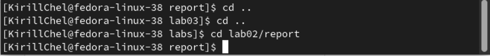

---
## Front matter
title: "Отчёт по лабораторной работе №3"
subtitle: "Дисциплина: архитектура компьютера"
author: "Челухаев Кирилл Александрович"

## Generic otions
lang: ru-RU
toc-title: "Содержание"

## Bibliography
bibliography: bib/cite.bib
csl: pandoc/csl/gost-r-7-0-5-2008-numeric.csl

## Pdf output format
toc: true # Table of contents
toc-depth: 2
lof: true # List of figures
lot: true # List of tables
fontsize: 12pt
linestretch: 1.5
papersize: a4
documentclass: scrreprt
## I18n polyglossia
polyglossia-lang:
  name: russian
  options:
	- spelling=modern
	- babelshorthands=true
polyglossia-otherlangs:
  name: english
## I18n babel
babel-lang: russian
babel-otherlangs: english
## Fonts
mainfont: IBM Plex Serif
romanfont: IBM Plex Serif
sansfont: IBM Plex Sans
monofont: IBM Plex Mono
mathfont: STIX Two Math
mainfontoptions: Ligatures=Common,Ligatures=TeX,Scale=0.94
romanfontoptions: Ligatures=Common,Ligatures=TeX,Scale=0.94
sansfontoptions: Ligatures=Common,Ligatures=TeX,Scale=MatchLowercase,Scale=0.94
monofontoptions: Scale=MatchLowercase,Scale=0.94,FakeStretch=0.9
mathfontoptions:
## Biblatex
biblatex: true
biblio-style: "gost-numeric"
biblatexoptions:
  - parentracker=true
  - backend=biber
  - hyperref=auto
  - language=auto
  - autolang=other*
  - citestyle=gost-numeric
## Pandoc-crossref LaTeX customization
figureTitle: "Рис."
tableTitle: "Таблица"
listingTitle: "Листинг"
lofTitle: "Список иллюстраций"
lotTitle: "Список таблиц"
lolTitle: "Листинги"
## Misc options
indent: true
header-includes:
  - \usepackage{indentfirst}
  - \usepackage{float} # keep figures where there are in the text
  - \floatplacement{figure}{H} # keep figures where there are in the text
---

# Цель работы

Целью работы является освоение процедуры оформления отчетов с помощью легковесного языка разметки Markdown.
# Задание

2.1 Установка необходимого ПО
2.2 Заполнение отчета по выполнению лабораторной работы №3 с помощью языка разметки Markdown
2.3 Задания для самостоятельной работы

# Теоретическое введение

 Markdown - легковесный язык разметки, созданный с целью обозначения форматирования в простом тексте, с максимальным сохранением его читаемости человеком, и пригодный для машинного преобразования в языки для продвинутых публикаций. Внутритекстовые формулы делаются аналогично формулам
LaTeX. B Markdown вставить изображение в документ можно с помощью непосред-ственного указания адреса изображения. Синтаксис Markdown для встроенной ссылки состоит из части [link text], представляющей текст гиперссылки, и части (file-name.md) - URL-адреса или имени файла, на который дается ссылка.
Markdown поддерживает как встраивание фрагментов кода в предложение, так и их размещение между предложениями в виде отдельных огражденных бло-ков. Огражденные блоки кода - это простой способ выделить синтаксис для фрагментов кода.

# Выполнение лабораторной работы
## Установка TeX Live

Я установил TeX Live и распаковал архив (рис. [-@fig:001])

{#fig:001 width=70%}

Теперь я перешел в распакованную папку и запустил скрипт с правами root, используя sudo в начале команды (рис. [-@fig:002])

{#fig:002 width=70%}

Далее я добавил /usr/local/texlive/2024/bin/aarch64-linux в свой PATH для текущей и следующих сессиях (рис. [-@fig:003])

{#fig:003 width=70%}

## Установка pandoc и pandoc-crossref 

Я скачал pandoc версии 2.18 (рис. [-@fig:004])

{#fig:004 width=70%}

Далее я скачал pandoc-crossref (рис. [-@fig:005])

{#fig:005 width=70%}

Теперь я распаковываю скачанные архивы (рис. [-@fig:006])

{#fig:006 width=70%}

Далее я скопировал файлы pandoc и pandoc-crosref в каталог /usr/local/bin/ (рис. [-@fig:007])

{#fig:007 width=70%}

Я проверил корректность выполнения команд при помощи команды ls (рис. [-@fig:008])

{#fig:008 width=70%}

## Заполнения отчета по выполнению лабораторной работы с помощью языка разметки Markdown

Я открыл терминал и перешел в каталог курса, сформированный при выполнении лабораторной работы №2 (рис. [-@fig:009])

{#fig:009 width=70%}

Далее я обновил локальный репозиторий (рис. [-@fig:010])

{#fig:010 width=70%}

Теперь я перешел в каталог с шаблоном по лабораторной работе №3 (рис. [-@fig:011])

{#fig:011 width=70%}

Я провел компиляцию шаблона с использованием Makefile с помощью команды make (рис. [-@fig:012])

{#fig:012 width=70%}

Далее я удалил полученные файлы с использованием Makefile при помощи команды make clean (рис. [-@fig:013])

{#fig:013 width=70%}

Далее я открыл файл report.md в текстовом редакторе и изучил его структуру (рис. [-@fig:014])

{#fig:014 width=70%}

Далее я заполнил отчет с использованием Makefile и загрузил файлы на GitHub

## Задание для самостоятельной работы 

Я перешел в каталог лабораторной работы №2 (рис. [-@fig:015])

{#fig:015 width=70%}

Я заполнил отчет с помощью Markdown и скомпилировал файлы (рис. [-@fig:016])

{#fig:016 width=70%}

# Выводы

В результате выполнения данной лабораторной работы я освоил процедуры оформления отчетов с помощью легковесного языка разметки Markdown.

# Список литературы{.unnumbered}

1. GDB: The GNU Project Debugger. — URL: https://www.gnu.org/software/gdb/.
2. GNU Bash Manual. — 2016. — URL: https://www.gnu.org/software/bash/manual/.
3. Midnight Commander Development Center. — 2021. — URL: https://midnight-commander.
org/.
4. NASM Assembly Language Tutorials. — 2021. — URL: https://asmtutor.com/.
5. Newham C. Learning the bash Shell: Unix Shell Programming. — O’Reilly Media, 2005. —
354 с. — (In a Nutshell). — ISBN 0596009658. — URL: http://www.amazon.com/Learningbash-Shell-Programming-Nutshell/dp/0596009658.
6. Robbins A. Bash Pocket Reference. — O’Reilly Media, 2016. — 156 с. — ISBN 978-1491941591.
7. The NASM documentation. — 2021. — URL: https://www.nasm.us/docs.php.
8. Zarrelli G. Mastering Bash. — Packt Publishing, 2017. — 502 с. — ISBN 9781784396879.
9. Колдаев В. Д., Лупин С. А. Архитектура ЭВМ. — М. : Форум, 2018.
10. Куляс О. Л., Никитин К. А. Курс программирования на ASSEMBLER. — М. : Солон-Пресс,
2017.
11. Новожилов О. П. Архитектура ЭВМ и систем. — М. : Юрайт, 2016.
12. Расширенный ассемблер: NASM. — 2021. — URL: https://www.opennet.ru/docs/RUS/nasm/.
13. Робачевский А., Немнюгин С., Стесик О. Операционная система UNIX. — 2-е изд. — БХВПетербург, 2010. — 656 с. — ISBN 978-5-94157-538-1.
14. Столяров А. Программирование на языке ассемблера NASM для ОС Unix. — 2-е изд. —
М. : МАКС Пресс, 2011. — URL: http://www.stolyarov.info/books/asm_unix.
15. Таненбаум Э. Архитектура компьютера. — 6-е изд. — СПб. : Питер, 2013. — 874 с. —
(Классика Computer Science).
16. Таненбаум Э., Бос Х. Современные операционные системы. — 4-е изд. — СПб. : Питер,
2015 — 1120 с. — (Классика Computer Science).
::: {#refs}
:::
