---
## Front matter
title: "Отчет по лабораторной работе №5"
subtitle: "Дисциплина: Архитектура компьютера"
author: "Челухаeв Кирилл Александрович"

## Generic otions
lang: ru-RU
toc-title: "Содержание"

## Bibliography
bibliography: bib/cite.bib
csl: pandoc/csl/gost-r-7-0-5-2008-numeric.csl

## Pdf output format
toc: true # Table of contents
toc-depth: 2
lof: true # List of figures
lot: true # List of tables
fontsize: 12pt
linestretch: 1.5
papersize: a4
documentclass: scrreprt
## I18n polyglossia
polyglossia-lang:
  name: russian
  options:
	- spelling=modern
	- babelshorthands=true
polyglossia-otherlangs:
  name: english
## I18n babel
babel-lang: russian
babel-otherlangs: english
## Fonts
mainfont: IBM Plex Serif
romanfont: IBM Plex Serif
sansfont: IBM Plex Sans
monofont: IBM Plex Mono
mathfont: STIX Two Math
mainfontoptions: Ligatures=Common,Ligatures=TeX,Scale=0.94
romanfontoptions: Ligatures=Common,Ligatures=TeX,Scale=0.94
sansfontoptions: Ligatures=Common,Ligatures=TeX,Scale=MatchLowercase,Scale=0.94
monofontoptions: Scale=MatchLowercase,Scale=0.94,FakeStretch=0.9
mathfontoptions:
## Biblatex
biblatex: true
biblio-style: "gost-numeric"
biblatexoptions:
  - parentracker=true
  - backend=biber
  - hyperref=auto
  - language=auto
  - autolang=other*
  - citestyle=gost-numeric
## Pandoc-crossref LaTeX customization
figureTitle: "Рис."
tableTitle: "Таблица"
listingTitle: "Листинг"
lofTitle: "Список иллюстраций"
lotTitle: "Список таблиц"
lolTitle: "Листинги"
## Misc options
indent: true
header-includes:
  - \usepackage{indentfirst}
  - \usepackage{float} # keep figures where there are in the text
  - \floatplacement{figure}{H} # keep figures where there are in the text
---

# Цель работы

Приобретение практических навыков работы в Midnight Commander. Освоение инструкций
языка ассемблера mov и int.

# Задание
1. Основы работы с mc
2. Структура программы на языке ассемблера NASM
3. Подключение внешнего файла
4. Выполнение заданий для самостоятельной работы

# Теоретическое введение

Midnight Commander (или просто mc) — это программа, которая позволяет просматривать
структуру каталогов и выполнять основные операции по управлению файловой системой,
т.е. mc является файловым менеджером. Midnight Commander позволяет сделать работу с
файлами более удобной и наглядной.
Для активации оболочки Midnight Commander достаточно ввести в командной строке mc и
нажать клавишу Enter (рис. 5.1).
В Midnight Commander используются функциональные клавиши F1 — F10 , к которым
привязаны часто выполняемые операции (табл. 5.1).

Программа на языке ассемблера NASM, как правило, состоит из трёх секций: секция кода
программы (SECTION .text), секция инициированных (известных во время компиляции)
данных (SECTION .data) и секция неинициализированных данных (тех, под которые во
время компиляции только отводится память, а значение присваивается в ходе выполнения
программы) (SECTION .bss).
Для объявления инициированных данных в секции .data используются директивы DB, DW,
DD, DQ и DT, которые резервируют память и указывают, какие значения должны храниться в
этой памяти:
• DB (define byte) — определяет переменную размером в 1 байт;
• DW (define word) — определяет переменную размеров в 2 байта (слово);
• DD (define double word) — определяет переменную размером в 4 байта (двойное слово);
• DQ (define quad word)— определяет переменную размером в 8 байт (учетверённое слово);
• DT (define ten bytes) — определяет переменную размером в 10 байт.

Директивы используются для объявления простых переменных и для объявления массивов. Для определения строк принято использовать директиву DB в связи с особенностями
хранения данных в оперативной памяти.
Синтаксис директив определения данных следующий:
<имя> DB <операнд> [, <операнд>] [, <операнд>]

Инструкция языка ассемблера intпредназначена для вызова прерывания с указанным
номером. В общем виде она записывается в виде
```int n
```
Здесь n — номер прерывания, принадлежащий диапазону 0–255.
При программировании в Linux с использованием вызовов ядра sys_calls n=80h (принято
задавать в шестнадцатеричной системе счисления).

# Выполнение лабораторной работы
## Основы работы с mc
 Открываю Midnight Commander, введя в терминал mc (рис. [-@fig:001]).
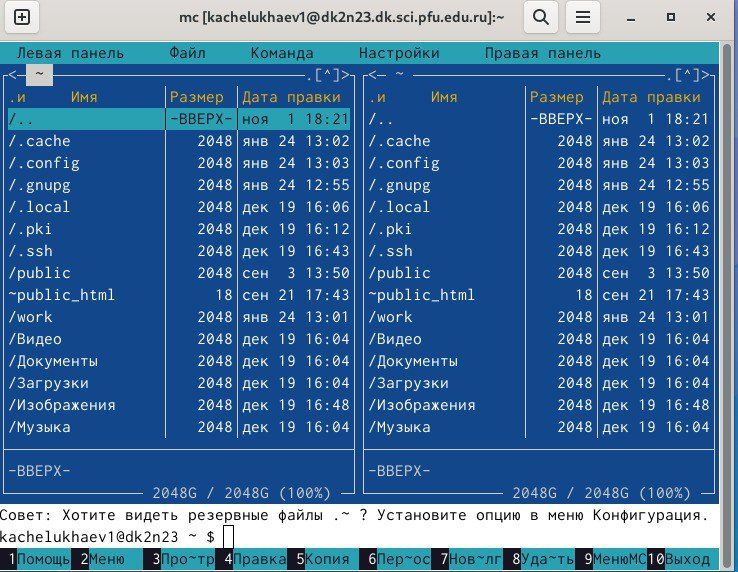{#fig:001 width=70%}

Перехожу в каталог курса (рис. [-@fig:002]).
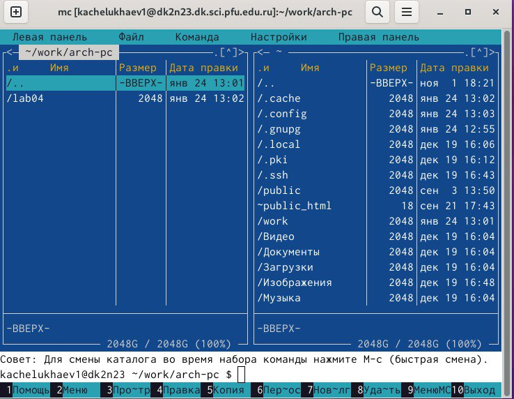{#fig:002 width=70%}

С помощью функциональной клавиши F7 создаю новый каталог и перехожу в созданный каталог lab05 (рис. [-@fig:003]).
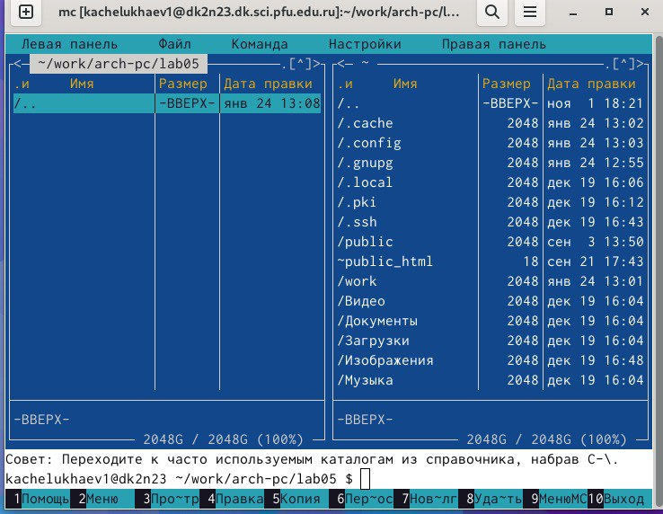{#fig:003 width=70%}

Создаю файл lab5-1.asm (рис. [-@fig:004]).
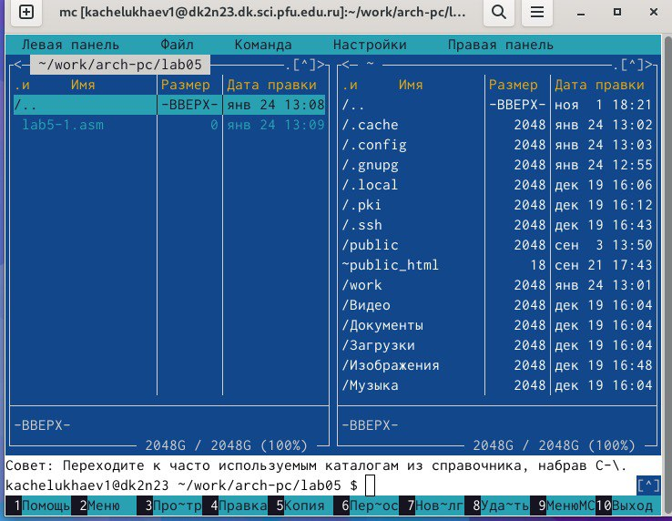{#fig:004 width=70%}

## Структура программы на языке ассемблера NASM

С помощью клавиши F4 я открыл файл и сохранил в него код программы для вывода сообщения на экран и ввода строки с клавиатуры (рис. [-@fig:005]).
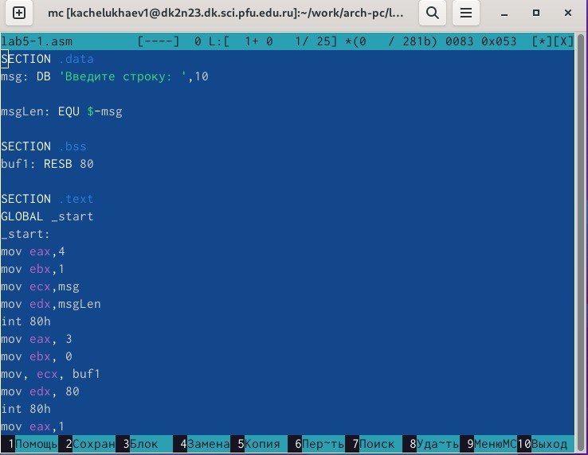{#fig:005 width=70%}

Транслирую текст программы файла в объектный файл. Далее выполняю компоновку объектного файла и запускаю программу. (рис. [-@fig:006]).
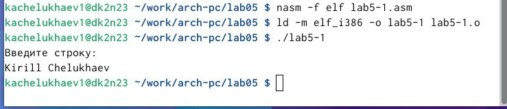{#fig:006 width=70%}

## Подключение внешнего файла 

Я скачал файл in_out.asm со страницы курса в ТУИС и скопировал его в каталог в котором находится файл с кодом программы. (рис. [-@fig:007]).
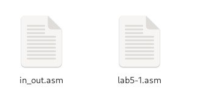{#fig:007 width=70%}

С помощью функциональной клавиши F5 копирую файл lab5-1.asm в тот же каталог под именем lab05-2.asm. Изменяю содержимое файла lab6-2.asm, чтобы в программе использовались подпрограммы из внешнего файла in_out.asm и компилирую исполняемые файлы (рис. [-@fig:008]).
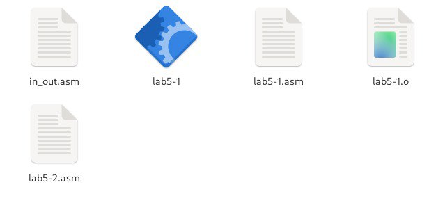{#fig:008 width=70%}


Проверяю разницу команд sprintLF и sprint соответственно. (рис. [-@fig:009]).
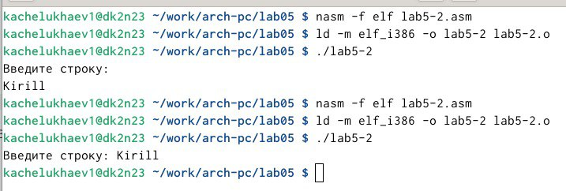{#fig:009 width=70%}

## Задание для самостоятельной работы

Создайю копию файла lab5-1.asm с именем lab5-3.asm. Вношу изменения в программу (без использования внешнего файла in_out.asm), так чтобы она работала по следующему алгоритму:
• вывести приглашение типа “Введите строку:”;
• ввести строку с клавиатуры;
• вывести введённую строку на экран.
И запускаю исполняемый файл
(рис. [-@fig:010]).
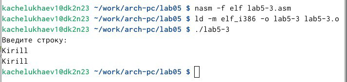{#fig:010 width=70%}

Создаю копию файла lab5-2.asm с именем lab5-4.asm. Исправляю текст программы с использование подпрограмм из внешнего файла in_out.asm, так чтобы она работала по следующему
алгоритму:
• вывести приглашение типа “Введите строку:”;
• ввести строку с клавиатуры;
• вывести введённую строку на экран
И запускаю исполняемый файл
(рис. [-@fig:011]).
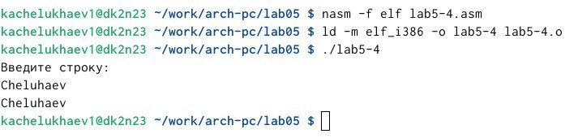{#fig:011 width=70%}
# Выводы

При выполнении данной лабораторной работы я приобрел практические навыки работы в Midnight Commander, а также освоил инструкции языка ассемблера mov и int.


# Список литературы{.unnumbered}

::: {#refs}
:::
