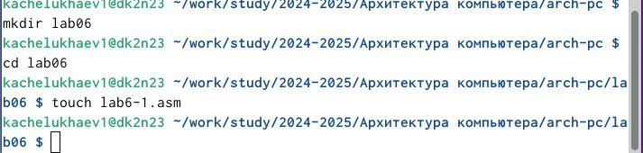
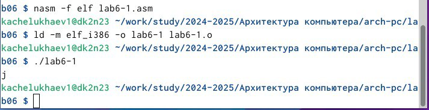
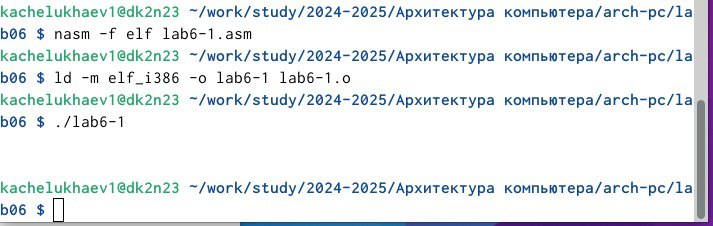
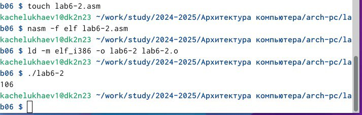
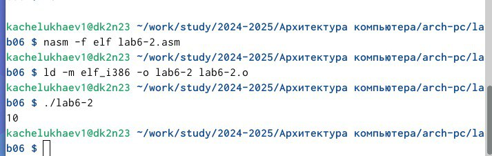
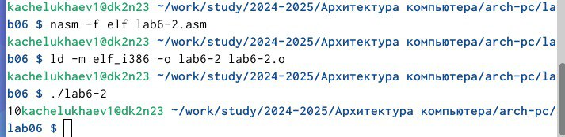
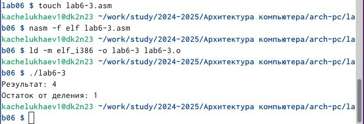
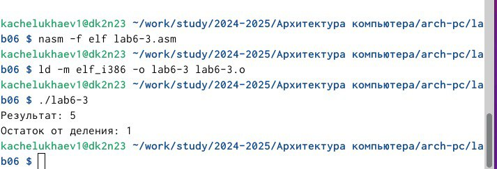
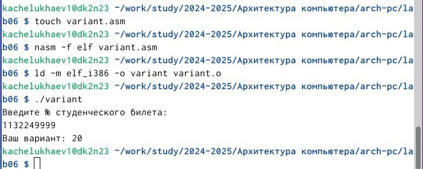
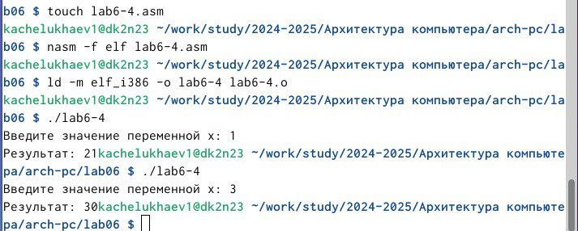

---
## Front matter
title: "Отчет по лабораторной работе №6"
subtitle: "Дисциплина: Архитектура компьютера"
author: "Челухаeв Кирилл Александрович"

## Generic otions
lang: ru-RU
toc-title: "Содержание"

## Bibliography
bibliography: bib/cite.bib
csl: pandoc/csl/gost-r-7-0-5-2008-numeric.csl

## Pdf output format
toc: true # Table of contents
toc-depth: 2
lof: true # List of figures
lot: true # List of tables
fontsize: 12pt
linestretch: 1.5
papersize: a4
documentclass: scrreprt
## I18n polyglossia
polyglossia-lang:
  name: russian
  options:
	- spelling=modern
	- babelshorthands=true
polyglossia-otherlangs:
  name: english
## I18n babel
babel-lang: russian
babel-otherlangs: english
## Fonts
mainfont: IBM Plex Serif
romanfont: IBM Plex Serif
sansfont: IBM Plex Sans
monofont: IBM Plex Mono
mathfont: STIX Two Math
mainfontoptions: Ligatures=Common,Ligatures=TeX,Scale=0.94
romanfontoptions: Ligatures=Common,Ligatures=TeX,Scale=0.94
sansfontoptions: Ligatures=Common,Ligatures=TeX,Scale=MatchLowercase,Scale=0.94
monofontoptions: Scale=MatchLowercase,Scale=0.94,FakeStretch=0.9
mathfontoptions:
## Biblatex
biblatex: true
biblio-style: "gost-numeric"
biblatexoptions:
  - parentracker=true
  - backend=biber
  - hyperref=auto
  - language=auto
  - autolang=other*
  - citestyle=gost-numeric
## Pandoc-crossref LaTeX customization
figureTitle: "Рис."
tableTitle: "Таблица"
listingTitle: "Листинг"
lofTitle: "Список иллюстраций"
lotTitle: "Список таблиц"
lolTitle: "Листинги"
## Misc options
indent: true
header-includes:
  - \usepackage{indentfirst}
  - \usepackage{float} # keep figures where there are in the text
  - \floatplacement{figure}{H} # keep figures where there are in the text
---

# Цель работы

Освоение арифметических инструкций языка ассемблера NASM.

# Задание

1. Символьные и численные данные в NASM
2. Выполнение арифметических операций в NASM
3. Выполнение заданий для самостоятельной работы


# Теоретическое введение

Большинство инструкций на языке ассемблера требуют обработки операндов. Адрес операнда предоставляет место, где хранятся данные, подлежащие обработке. Это могут быть данные хранящиеся в регистре или в ячейке памяти.

Регистровая адресация – операнды хранятся в регистрах и в команде используются имена этих регистров, например: mov ax,bx.
Непосредственная адресация – значение операнда задается непосредственно в команде, Например: mov ax,2.
Адресация памяти – операнд задает адрес в памяти. В команде указывается символическое обозначение ячейки памяти, над содержимым которой требуется выполнить операцию.
Ввод информации с клавиатуры и вывод её на экран осуществляется в символьном виде. Кодирование этой информации производится согласно кодовой таблице символов ASCII. ASCII – сокращение от American Standard Code for Information Interchange (Американский стандартный код для обмена информацией). Согласно стандарту ASCII каждый символ кодируется одним байтом. Среди инструкций NASM нет такой, которая выводит числа (не в символьном виде). Поэтому, например, чтобы вывести число, надо предварительно преобразовать его цифры в ASCII-коды этих цифр и выводить на экран эти коды, а не само число. Если же выводить число на экран непосредственно, то экран воспримет его не как число, а как последовательность ASCII-символов – каждый байт числа будет воспринят как один ASCII-символ – и выведет на экран эти символы. Аналогичная ситуация происходит и при вводе данных с клавиатуры. Введенные данные будут представлять собой символы, что сделает невозможным получение корректного результата при выполнении над ними арифметических операций. Для решения этой проблемы необходимо проводить преобразование ASCII символов в числа и обратно


# Выполнение лабораторной работы

## Символьные и численные данные в NASM

Я создал каталог для программам лабораторной работы № 6, перейдите в него и
создал файл lab6-1.asm (рис. [-@fig:001]).

{#fig:001 width=70%}

Ввел в файл lab6-1.asm текст программы из ТУИС, создал исполняемый файл и запустил его (рис. [-@fig:002]).

{#fig:002 width=70%}

Я заменил строки 
``` NASM
mov eax,'6'
mov ebx,'4'
```
на строки 
``` NASM
mov eax,6
mov ebx,4
```
Создал исполняемый файл и запустил его. (рис. [-@fig:003]).

{#fig:003 width=70%}

Выводится символ с кодом 10 по таблице ASCII, который не отображается.

Далее я создал файл lab6-2.asm и ввел в него текст программы с использованием подпрограмм файла in_out.asm, скомпилировал и запустил. (рис. [-@fig:004]).

{#fig:004 width=70%}

В результате работы программы мы получим число 106. В данном случае, как и в первом,
команда add складывает коды символов ‘6’ и ‘4’ (54+52=106).

Аналогично предыдущему примеру изменил символы на числа.
Я заменил строки
``` NASM
mov eax,'6'
mov ebx,'4'
```
на строки 
``` NASM
mov eax,6
mov ebx,4
```

Создал исполняемый файл и запустил его (рис. [-@fig:005]).

{#fig:005 width=70%}

Заменил функцию iprintLF на iprint. Создал исполняемый файл и запустил его (рис. [-@fig:006]).

{#fig:006 width=70%}

iprint не добавляет к выводу символ переноса строки, в отличие от iprintLF.

## Выполнение арифметических операций в NASM

Я создал файл lab6-3.asm. Сохранил в него код программы из ТУИС. Создал исполняемый файл и запустил его. (рис. [-@fig:007]).

{#fig:007 width=70%}

Изменил текст программы для вычисления выражения 𝑓(𝑥) = (4 ∗ 6 + 2)/5. Создал
исполняемый файл и проверил его работу. (рис. [-@fig:008]).

{#fig:008 width=70%}

Создал файл variant.asm, вставил в него код программы из ТУИС. Создал исполняемый файл и запустил его (рис. [-@fig:009]).

{#fig:009 width=70%}

1. За вывод сообщения "Ваш вариант" отвечают строки кода:
``` NASM 
mov eax,rem
call sprint
```
2. Инструкция mov ecx, x используется, чтобы положить адрес вводимой строки x в регистр ecx mov edx, 80 - запись в регистр edx длины вводимой строки call sread - вызов подпрограммы из внешнего файла, обеспечивающей ввод сообщения с клавиатуры

3. call atoi используется для вызова подпрограммы из внешнего файла, которая преобразует ASCII-код символа в целое число и записывает результат в регистр eax

4. За вычисления варианта отвечают строки:
``` NASM
xor edx,edx ; обнуление edx для корректной работы div
mov ebx,20 ; ebx = 20
div ebx ; eax = eax/20, edx - остаток от деления
inc edx ; edx = edx + 1
```
5. При выполнении инструкции div ebx остаток от деления записывается в регистр edx

6. Инструкция inc edx увеличивает значение регистра edx на 1

7. За вывод на экран результатов вычислений отвечают строки:
``` NASM
mov eax,edx
call iprintLF
```
## Выполнение заданий для самостоятельной работы

Создаю файл lab6-4.asm с помощью утилиты touch и ввел код для у вычисления выражения y = f(x)в соответствии с моим вариантом. 
$f (x) = x^3 * 1/3 + 21$
И проверяю его работу (рис. [-@fig:010]).

{#fig:010 width=70%}

``` NASM
%include 'in_out.asm'  ; Подключение внешнего файла

SECTION .data          ; Секция инициированных данных
    msg:    db 'Введите значение переменной x: ', 0
    rem:    db 'Результат: ', 0

SECTION .bss           ; Секция неинициализированных данных
    x:      resb 80    ; Буфер для ввода x

SECTION .text          ; Секция кода
    global _start      ; Начало программы
_start:
    ; ---- Вывод приглашения к вводу ----
    mov eax, msg       ; Запись адреса выводимого сообщения в eax
    call sprint        ; Вызов подпрограммы печати сообщения

    ; ---- Ввод числа с клавиатуры ----
    mov ecx, x       ; Запись адреса переменной в ecx
    mov edx, 80      ; Запись длины вводимого значения в edx
    call sread       ; Вызов подпрограммы ввода сообщения

    ; ---- Преобразование ASCII в число ----
    mov eax, x       ; Передача строки для преобразования
    call atoi        ; Вызов atoi для конвертации ASCII -> число

    ; ---- Вычисление x³ * (1/3) + 21 ----
    mov ebx, eax     ; Сохранение x в ebx
    mul ebx          ; eax = eax * ebx (eax = x * x)
    mul ebx          ; eax = eax * ebx (eax = x * x * x)

    mov edx, 0       ; очищаем EDX для деления
    mov ecx, 3       ; Делитель (3)
    div ecx          ; eax = (x * x * x) / 3 (целочисленное деление)

    add eax, 21      ; eax = (x * x * x) / 3 + 21

    mov edi, eax     ; Запись результата в edi

    ; ---- Вывод результата на экран ----
    mov eax, rem       ; Вывод сообщения "Результат: "
    call sprint
    mov eax, edi      ; Вывод значения результата из edi
    call iprint

    call quit        ; Вызов подпрограммы завершения
```

# Выводы

При выполнении данной лабораторной работы я освоил арифметические инструкции языка ассемблера NASM.


# Список литературы{.unnumbered}

::: {#refs}
:::
