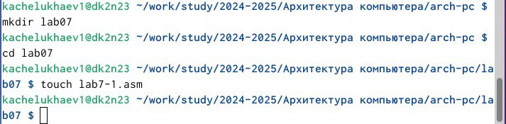
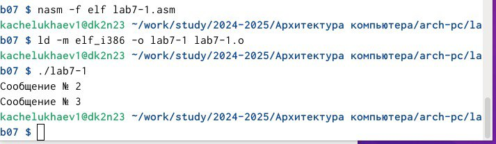
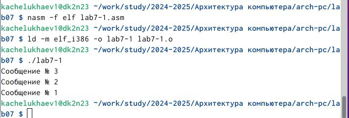
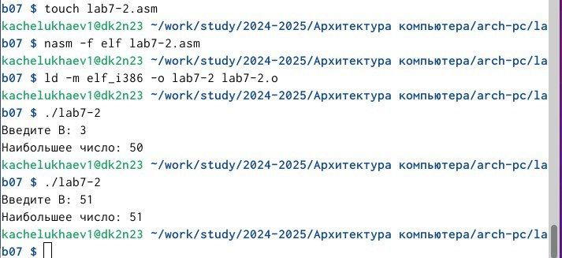
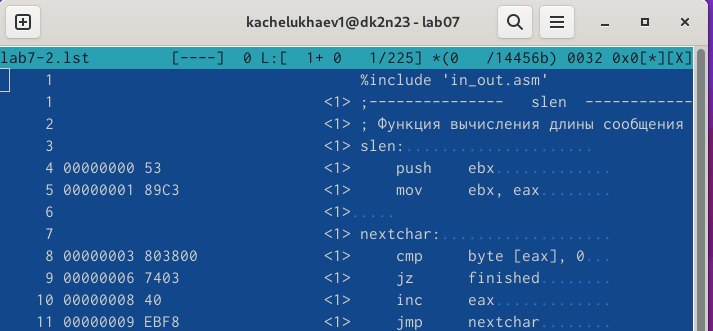
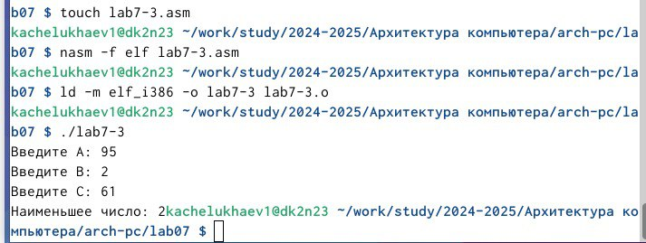
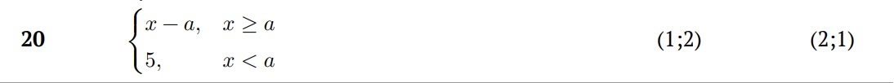
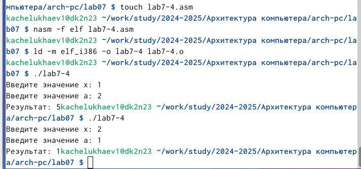

---
## Front matter
title: "Отчет по лабораторной работе №7"
subtitle: "Дисциплина: Архитектура компьютерa"
author: "Челухаeв Кирилл Александрович"

## Generic otions
lang: ru-RU
toc-title: "Содержание"

## Bibliography
bibliography: bib/cite.bib
csl: pandoc/csl/gost-r-7-0-5-2008-numeric.csl

## Pdf output format
toc: true # Table of contents
toc-depth: 2
lof: true # List of figures
lot: true # List of tables
fontsize: 12pt
linestretch: 1.5
papersize: a4
documentclass: scrreprt
## I18n polyglossia
polyglossia-lang:
  name: russian
  options:
	- spelling=modern
	- babelshorthands=true
polyglossia-otherlangs:
  name: english
## I18n babel
babel-lang: russian
babel-otherlangs: english
## Fonts
mainfont: IBM Plex Serif
romanfont: IBM Plex Serif
sansfont: IBM Plex Sans
monofont: IBM Plex Mono
mathfont: STIX Two Math
mainfontoptions: Ligatures=Common,Ligatures=TeX,Scale=0.94
romanfontoptions: Ligatures=Common,Ligatures=TeX,Scale=0.94
sansfontoptions: Ligatures=Common,Ligatures=TeX,Scale=MatchLowercase,Scale=0.94
monofontoptions: Scale=MatchLowercase,Scale=0.94,FakeStretch=0.9
mathfontoptions:
## Biblatex
biblatex: true
biblio-style: "gost-numeric"
biblatexoptions:
  - parentracker=true
  - backend=biber
  - hyperref=auto
  - language=auto
  - autolang=other*
  - citestyle=gost-numeric
## Pandoc-crossref LaTeX customization
figureTitle: "Рис."
tableTitle: "Таблица"
listingTitle: "Листинг"
lofTitle: "Список иллюстраций"
lotTitle: "Список таблиц"
lolTitle: "Листинги"
## Misc options
indent: true
header-includes:
  - \usepackage{indentfirst}
  - \usepackage{float} # keep figures where there are in the text
  - \floatplacement{figure}{H} # keep figures where there are in the text
---

# Цель работы

Изучение команд условного и безусловного переходов. Приобретение навыков написания
программ с использованием переходов. Знакомство с назначением и структурой файла
листинга.

# Задания

1. Реализация переходов в NASM
2. Изучение структуры файлы листинга
3. Задание для самостоятельной работы

# Теоретическое введение

Для реализации ветвлений в ассемблере используются так называемые команды передачи
управления или команды перехода. Можно выделить 2 типа переходов:
* условный переход – выполнение или не выполнение перехода в определенную точку
программы в зависимости от проверки условия.
* безусловный переход – выполнение передачи управления в определенную точку программы без каких-либо условий.

# Выполнение лабораторной работы

Я создал каталог lab07 для лабораторной работы №7 и создал в нем файл lab7-1.asm.(рис. [-@fig:001]).

{#fig:001 width=70%}

Я ввел в файл код программы из ТУИС, скомпилировал исполняемый файл и запустил его.(рис. [-@fig:002]).

{#fig:002 width=70%}

Далее я изменил текст программы добавив или изменив инструкции jmp, чтобы вывод программы был следующим:

*Сообщение № 3
*Сообщение № 2
*Сообщение № 1

Я скомпилировал исполняемый файл и проверил его работу (рис. [-@fig:003]).

{#fig:003 width=70%}

Далее я создал файл lab7-2.asm и ввел в него код программы, которая определяет и выводит на экран наибольшую из 3 целочисленных переменных: A,B и C. Создал исполняемый файл и проверил его работу для разных значений B. (рис. [-@fig:004]).

{#fig:004 width=70%}

## Изучение структуры файлы листинга

Обычно nasm создаёт в результате ассемблирования только объектный файл. Получить
файл листинга можно, указав ключ -l и задав имя файла листинга в командной строке.
Я создал файл листинга для программы из файла lab7-2.asm и открыл его. (рис. [-@fig:005]).

{#fig:005 width=70%}

1.  Строка 4: 4 00000000 53 <1> push ebx

* Адрес: 00000000 — это первый байт подпрограммы. Код будет помещён в память, начиная с этого адреса 

* Машинный код: 53 — это шестнадцатеричное представление машинного кода для инструкции push ebx. Инструкция push помещает содержимое регистра ebx в стек.

* Комментарии: <1> указывают на тип элемента в листинге. В данном случае это просто инструкция на ассемблере

* Действие: сохраняет текущее значение регистра ebx в стеке. Это необходимо для сохранения значения регистра ebx, которое будет использоваться в этой подпрограмме.

2. Строка 5: 5 00000001 89C3 <1> mov ebx, eax

* Адрес: 00000001 — инструкция будет помещена по этому адресу, который на 1 байт больше, чем у предыдущей инструкции.

* Машинный код: 89C3 — это машинный код для инструкции mov ebx, eax

* Комментарии: <1> — Указывает, что это ассемблерная инструкция.

* Действие: перемещает содержимое регистра eax в регистр ebx. 

3.  Строка 8: 8 00000003 803800 <1> cmp byte [eax], 0

* Адрес: 00000003 - Адрес памяти для этой инструкции.

* Машинный код: 803800 - Машинный код для инструкции cmp byte [eax], 0.

* Комментарии: <1> - Указывает, что это ассемблерная инструкция.

* Действие: Сравнивает байт по адресу, указанному в eax, с нулем. Это нужно для определения конца строки.

## Задание для самостоятельной работы

1. Напишите программу нахождения наименьшей из 3 целочисленных переменных a b c
Значения переменных выбрать из табл. 7.5 в соответствии с вариантом, полученным
при выполнении лабораторной работы № 7. Создайте исполняемый файл и проверьте
его работу. 

Я создал файл lab7-3.asm и написал в нем код для программы нахождения наименьшей из 3 целочисленных переменных a b c и проверил его работу (рис. [-@fig:006]).

{#fig:006 width=70%}

2. Напишите программу, которая для введенных с клавиатуры значений x и a вычисляет
значение заданной функции f(x) и выводит результат вычислений. Вид функции f(x)
выбрать из таблицы 7.6 вариантов заданий в соответствии с вариантом, полученным
при выполнении лабораторной работы № 7. Создайте исполняемый файл и проверьте
его работу для значений x и a из 7.6.
Я создал файл lab7-4.asm и написал в нем код для вычисления функции в соответствии с моим вариантом (рис. [-@fig:007]).

{#fig:007 width=70%}

и проверил его работу (рис. [-@fig:008]).

{#fig:008 width=70%}

# Выводы

В итоге я изучил команды условного и безусловного переходов и приобрел навыки написания программ с использованием переходов. познакомился с назначением и структурой файла листинга.

# Список литературы{.unnumbered}

::: {#refs}
:::
