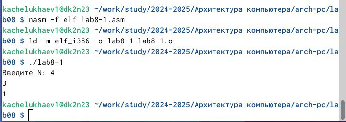

---
## Front matter
title: "Отчет по лабораторной работе №8"
subtitle: "Дисциплина: Архитектура компьютера"
author: "Челухаeв Кирилл Александрович"

## Generic otions
lang: ru-RU
toc-title: "Содержание"

## Bibliography
bibliography: bib/cite.bib
csl: pandoc/csl/gost-r-7-0-5-2008-numeric.csl

## Pdf output format
toc: true # Table of contents
toc-depth: 2
lof: true # List of figures
lot: true # List of tables
fontsize: 12pt
linestretch: 1.5
papersize: a4
documentclass: scrreprt
## I18n polyglossia
polyglossia-lang:
  name: russian
  options:
	- spelling=modern
	- babelshorthands=true
polyglossia-otherlangs:
  name: english
## I18n babel
babel-lang: russian
babel-otherlangs: english
## Fonts
mainfont: IBM Plex Serif
romanfont: IBM Plex Serif
sansfont: IBM Plex Sans
monofont: IBM Plex Mono
mathfont: STIX Two Math
mainfontoptions: Ligatures=Common,Ligatures=TeX,Scale=0.94
romanfontoptions: Ligatures=Common,Ligatures=TeX,Scale=0.94
sansfontoptions: Ligatures=Common,Ligatures=TeX,Scale=MatchLowercase,Scale=0.94
monofontoptions: Scale=MatchLowercase,Scale=0.94,FakeStretch=0.9
mathfontoptions:
## Biblatex
biblatex: true
biblio-style: "gost-numeric"
biblatexoptions:
  - parentracker=true
  - backend=biber
  - hyperref=auto
  - language=auto
  - autolang=other*
  - citestyle=gost-numeric
## Pandoc-crossref LaTeX customization
figureTitle: "Рис."
tableTitle: "Таблица"
listingTitle: "Листинг"
lofTitle: "Список иллюстраций"
lotTitle: "Список таблиц"
lolTitle: "Листинги"
## Misc options
indent: true
header-includes:
  - \usepackage{indentfirst}
  - \usepackage{float} # keep figures where there are in the text
  - \floatplacement{figure}{H} # keep figures where there are in the text
---

# Цель работы

Приобретение навыков написания программ с использованием циклов и обработкой
аргументов командной строки.

# Задание

1. Реализация циклов в NASM

2. Обработка аргументов командной строки

3. Задание для самостоятельной работы

# Теоретическое введение

Стек — это структура данных, организованная по принципу LIFO («Last In — First Out»
или «последним пришёл — первым ушёл»). Стек является частью архитектуры процессора и
реализован на аппаратном уровне. Для работы со стеком в процессоре есть специальные
регистры (ss, bp, sp) и команды.
Основной функцией стека является функция сохранения адресов возврата и передачи
аргументов при вызове процедур. Кроме того, в нём выделяется память для локальных
переменных и могут временно храниться значения регистров.
На рис. 8.1 показана схема организации стека в процессоре.
Стек имеет вершину, адрес последнего добавленного элемента, который хранится в регистре esp (указатель стека). Противоположный конец стека называется дном. Значение,
помещённое в стек последним, извлекается первым. При помещении значения в стек указатель стека уменьшается, а при извлечении — увеличивается.
Для стека существует две основные операции добавление элемента в вершину стека (push)
Команда push размещает значение в стеке,извлечение элемента из вершины стека (pop). т.е. помещает значение в ячейку памяти, на
которую указывает регистр esp, после этого значение регистра esp увеличивается на 4.
Данная команда имеет один операнд — значение, которое необходимо поместить в стек.
Команда pop извлекает значение из стека, т.е. извлекает значение из ячейки памяти, на
которую указывает регистр esp, после этого уменьшает значение регистра esp на 4. У этой
команды также один операнд, который может быть регистром или переменной в памяти.
Нужно помнить, что извлечённый из стека элемент не стирается из памяти и остаётся как
“мусор”, который будет перезаписан при записи нового значения в стек.

# Выполнение лабораторной работы

## Реализация циклов в NASM

Я создал каталог для программам лабораторной работы № 8, перешел в него и создал
файл lab8-1.asm (рис. [-@fig:001]).

{#fig:001 width=70%}
``` NASM
%include 'in_out.asm'
SECTION .data
msg1 db 'Введите N: ',0h

SECTION .bss
N: resb 10
SECTION .text
global _start
_start:
; ----- Вывод сообщения 'Введите N: '
mov eax,msg1
call sprint
; ----- Ввод 'N'
mov ecx, N
mov edx, 10
call sread
; ----- Преобразование 'N' из символа в число
mov eax,N
call atoi
mov [N],eax
; ------ Организация цикла
mov ecx,[N] ; Счетчик цикла, `ecx=N`
label:
mov [N],ecx
mov eax,[N]
call iprintLF ; Вывод значения `N`
loop label ; `ecx=ecx-1` и если `ecx` не '0'
; переход на `label`
call quit
```
Я ввел в файл lab8-1.asm текст программы из листинга. Создал исполняемый файл
и проверил его работу.  (рис. [-@fig:002]).

{#fig:002 width=70%}

Данный пример показывает, что использование регистра ecx в теле цилка loop может
привести к некорректной работе программы. Я изменил текст программы добавив изменение
значение регистра ecx в цикле

``` NASM
label:
sub ecx,1 ; `ecx=ecx-1`
mov [N],ecx
mov eax,[N]
call iprintLF
loop label
```
Создал исполняемый файл и проверил его работу (рис. [-@fig:003]).

{#fig:003 width=70%}

Для использования регистра ecx в цикле и сохранения корректности работы программы
можно использовать стек. Я внес изменения в текст программы добавив команды push
и pop (добавления в стек и извлечения из стека) для сохранения значения счетчика цикла loop:

``` NASM
label:
push ecx ; добавление значения ecx в стек
sub ecx,1
mov [N],ecx
mov eax,[N]
call iprintLF
pop ecx ; извлечение значения ecx из стека
loop label
```
Я создал исполняемый файл и проверил его работу. (рис. [-@fig:004]).

{#fig:004 width=70%}

## Обработка аргументов командной строки

При разработке программ иногда встает необходимость указывать аргументы, которые
будут использоваться в программе, непосредственно из командной строки при запуске
программы.
При запуске программы в NASM аргументы командной строки загружаются в стек в обратном порядке, кроме того в стек записывается имя программы и общее количество аргументов.
Последние два элемента стека для программы, скомпилированной NASM, – это всегда имя
программы и количество переданных аргументов.
Таким образом, для того чтобы использовать аргументы в программе, их просто нужно
извлечь из стека. Обработку аргументов нужно проводить в цикле. Т.е. сначала нужно извлечь из стека количество аргументов, а затем циклично для каждого аргумента выполнить
логику программы. В качестве примера рассмотрим программу, которая выводит на экран
аргументы командной строки. 
``` NASM
%include 'in_out.asm'
SECTION .text
global _start
_start:
pop ecx ; Извлекаем из стека в `ecx` количество
; аргументов (первое значение в стеке)
pop edx ; Извлекаем из стека в `edx` имя программы
; (второе значение в стеке)
sub ecx, 1 ; Уменьшаем `ecx` на 1 (количество
; аргументов без названия программы)
next:
cmp ecx, 0 ; проверяем, есть ли еще аргументы
jz _end ; если аргументов нет выходим из цикла
; (переход на метку `_end`)
pop eax ; иначе извлекаем аргумент из стека
call sprintLF ; вызываем функцию печати
loop next ; переход к обработке следующего
; аргумента (переход на метку `next`)
_end:
call quit
```

Я создал файл lab8-2.asm, создал исполняемый файл и запустил его, указав аргументы:
user@dk4n31:~$ ./lab8-2 аргумент1 аргумент 2 'аргумент 3' (рис. [-@fig:005]).

{#fig:005 width=70%}

Рассмотрим еще один пример программы которая выводит сумму чисел, которые передаются в программу как аргументы. Я создал файл lab8-3.asm  и ввел в него текст программы 
``` NASM
%include 'in_out.asm'
SECTION .data
msg db "Результат: ",0
SECTION .text
global _start
_start:
pop ecx ; Извлекаем из стека в `ecx` количество
; аргументов (первое значение в стеке)
pop edx ; Извлекаем из стека в `edx` имя программы
; (второе значение в стеке)
sub ecx,1 ; Уменьшаем `ecx` на 1 (количество
; аргументов без названия программы)
mov esi, 0 ; Используем `esi` для хранения
; промежуточных сумм
next:
cmp ecx,0h ; проверяем, есть ли еще аргументы
jz _end ; если аргументов нет выходим из цикла
; (переход на метку `_end`)
pop eax ; иначе извлекаем следующий аргумент из стека
call atoi ; преобразуем символ в число
add esi,eax ; добавляем к промежуточной сумме
; след. аргумент `esi=esi+eax`
loop next ; переход к обработке следующего аргумента
_end:
mov eax, msg ; вывод сообщения "Результат: "
call sprint
mov eax, esi ; записываем сумму в регистр `eax`
call iprintLF ; печать результата
call quit ; завершение программы
```
Создал исполняемый файл и запустил его, указав аргументы. (рис. [-@fig:006]).

{#fig:006 width=70%}

Далее я изменил текст программы для вычисления произведения аргументов
командной строки и записал его в файл lab8-3.asm. (рис. [-@fig:007]).

{#fig:007 width=70%}

##  Задание для самостоятельной работы

1. Напишите программу, которая находит сумму значений функции f(x) для x = x1, x2, ..., xn, т.е. программа должна выводить значение f(x1) + f(x2) + ... + f(xn).
Значения xi передаются как аргументы.

вид функции:
$f(x) = 3*(10+x)$

Я создал  файл lab8-4.asm и написал в нем код программы и проверил его работу: ( рис. [-@fig:008]).

{#fig:008 width=70%}
``` NASM
%include 'in_out.asm'

SECTION .data
    msg: db "Сумма значений f(x): ", 0

SECTION .text
    global _start

_start:
    ; ---- Извлечение количества аргументов и имени программы ----
    pop ecx        ; Извлекаем количество аргументов (включая имя программы)
    pop edx        ; Извлекаем имя программы (не используем)
    sub ecx, 1     ; Уменьшаем количество аргументов (исключая имя программы)

    mov esi, 0     ; Инициализируем сумму f(x) в esi

next_arg:
    cmp ecx, 0
    jz end_loop    ; Если нет аргументов, перейти к выводу результата

    ; ---- Вычисление f(x) ----
    pop eax      ; Загружаем текущий аргумент x
    call atoi      ; Преобразовываем строку в число

    add eax, 10      ; Вычисляем 10+x
    mov ebx, 3        ; Загружаем 3 для умножения
    mul ebx            ; Умножаем (10 + x) на 3
    add esi, eax      ; добавляем результат в сумму f(x)

    loop next_arg

end_loop:
    ; ---- Вывод результата ----
    mov eax, msg    ; Вывод сообщения "Сумма значений f(x): "
    call sprint
    mov eax, esi    ; Записываем сумму значений f(x) в регистр 'eax'
    call iprintLF   ; Вывод результата
    call quit       ; Выход из программы
```
# Выводы

Таким образом, я приобрел навыкови написания программ с использованием циклов и обработкой аргументов командной строки.

# Список литературы{.unnumbered}

::: {#refs}
:::
