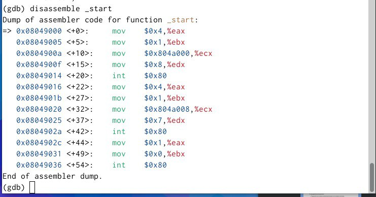

---
## Front matter
title: "Отчет по лабораторной работе №9"
subtitle: "Дисциплина: Архитектура компьютерa"
author: "Челухаeв Кирилл Александрович"

## Generic otions
lang: ru-RU
toc-title: "Содержание"

## Bibliography
bibliography: bib/cite.bib
csl: pandoc/csl/gost-r-7-0-5-2008-numeric.csl

## Pdf output format
toc: true # Table of contents
toc-depth: 2
lof: true # List of figures
lot: true # List of tables
fontsize: 12pt
linestretch: 1.5
papersize: a4
documentclass: scrreprt
## I18n polyglossia
polyglossia-lang:
  name: russian
  options:
	- spelling=modern
	- babelshorthands=true
polyglossia-otherlangs:
  name: english
## I18n babel
babel-lang: russian
babel-otherlangs: english
## Fonts
mainfont: IBM Plex Serif
romanfont: IBM Plex Serif
sansfont: IBM Plex Sans
monofont: IBM Plex Mono
mathfont: STIX Two Math
mainfontoptions: Ligatures=Common,Ligatures=TeX,Scale=0.94
romanfontoptions: Ligatures=Common,Ligatures=TeX,Scale=0.94
sansfontoptions: Ligatures=Common,Ligatures=TeX,Scale=MatchLowercase,Scale=0.94
monofontoptions: Scale=MatchLowercase,Scale=0.94,FakeStretch=0.9
mathfontoptions:
## Biblatex
biblatex: true
biblio-style: "gost-numeric"
biblatexoptions:
  - parentracker=true
  - backend=biber
  - hyperref=auto
  - language=auto
  - autolang=other*
  - citestyle=gost-numeric
## Pandoc-crossref LaTeX customization
figureTitle: "Рис."
tableTitle: "Таблица"
listingTitle: "Листинг"
lofTitle: "Список иллюстраций"
lotTitle: "Список таблиц"
lolTitle: "Листинги"
## Misc options
indent: true
header-includes:
  - \usepackage{indentfirst}
  - \usepackage{float} # keep figures where there are in the text
  - \floatplacement{figure}{H} # keep figures where there are in the text
---

# Цель работы

Приобретение навыков написания программ с использованием подпрограмм. Знакомство
с методами отладки при помощи GDB и его основными возможностями.

# Задание

1. Реализация подпрограмм в NASM
2. Отладка программам с помощью GDB
3. Задание для самостоятельной работы


# Теоретическое введение
Отладка — это процесс поиска и исправления ошибок в программе. В общем случае его
можно разделить на четыре этапа:
* обнаружение ошибки;
* поиск её местонахождения;
* определение причины ошибки;
* исправление ошибки.
Можно выделить следующие типы ошибок:
* синтаксические ошибки — обнаруживаются во время трансляции исходного кода и
вызваны нарушением ожидаемой формы или структуры языка;
* семантические ошибки — являются логическими и приводят к тому, что программа
запускается, отрабатывает, но не даёт желаемого результата;
* ошибки в процессе выполнения — не обнаруживаются при трансляции и вызывают прерывание выполнения программы (например, это ошибки, связанные с переполнением
или делением на ноль).
Второй этап — поиск местонахождения ошибки. Некоторые ошибки обнаружить довольно трудно. Лучший способ найти место в программе, где находится ошибка, это разбить
программу на части и произвести их отладку отдельно друг от друга.
Третий этап — выяснение причины ошибки. После определения местонахождения ошибки
обычно проще определить причину неправильной работы программы.
Последний этап — исправление ошибки. После этого при повторном запуске программы,
может обнаружиться следующая ошибка, и процесс отладки начнётся заново.

# Выполнение лабораторной работы

## Реализация подпрограмм в NASM

Я создал каталог для выполнения лабораторной работы № 9, перешел в него и создал файл lab9-1.asm (рис. [-@fig:001]).

{#fig:001 width=70%}

В качестве примера рассмотрим программу вычисления арифметического выражения
f(x) = 2x + 7 с помощью подпрограммы _calcul. В данном примере x вводится с
клавиатуры, а само выражение вычисляется в подпрограмме.
``` NASM
%include 'in_out.asm'
SECTION .data
msg: DB 'Введите x: ',0
result: DB '2x+7=',0
SECTION .bss
x: RESB 80
res: RESB 80
SECTION .text
GLOBAL _start
_start:
;------------------------------------------
; Основная программа
;------------------------------------------
mov eax, msg
call sprint
mov ecx, x
mov edx, 80
call sread
mov eax,x
call atoi
call _calcul ; Вызов подпрограммы _calcul
mov eax,result
call sprint
mov eax,[res]
call iprintLF
call quit
;------------------------------------------
; Подпрограмма вычисления
; выражения "2x+7"
_calcul:
mov ebx,2
mul ebx
add eax,7
mov [res],eax
ret ; выход из подпрограммы

```
Первые строки программы отвечают за вывод сообщения на экран (call sprint), чтение
данных введенных с клавиатуры (call sread) и преобразования введенных данных из
символьного вида в численный (call atoi).

Инструкция ret является последней в подпрограмме и ее исполнение приводит к возвращению в основную программу к инструкции, следующей за инструкцией call, которая
вызвала данную подпрограмму.

Я ввел в файл lab9-1.asm текст программы. Создал исполняемый
файл и проверил его работу. (рис. [-@fig:002]).

{#fig:002 width=70%}

Далее я изменил текст программы, добавив подпрограмму _subcalcul в подпрограмму _calcul, для вычисления выражения f(g(x)), где x вводится с клавиатуры, f(x) = 2x + 7, g(x) = 3x − 1. Т.е. x передается в подпрограмму _calcul из нее в подпрограмму _subcalcul, где вычисляется выражение g(x), результат возвращается в _calcul и вычисляется выражение f(g(x)). Результат возвращается в основную программу для вывода результата на экран. (рис. [-@fig:003]).

{#fig:003 width=70%}

## Отладка программам с помощью GDB

Я создал файл lab9-2.asm с текстом программы из ТУИС.

``` NASM
SECTION .data
msg1: db "Hello, ",0x0
msg1Len: equ $ - msg1
msg2: db "world!",0xa
msg2Len: equ $ - msg2
SECTION .text
global _start
_start:
mov eax, 4
mov ebx, 1
mov ecx, msg1
mov edx, msg1Len
int 0x80
mov eax, 4
mov ebx, 1
mov ecx, msg2
mov edx, msg2Len
int 0x80
mov eax, 1
mov ebx, 0
int 0x80
```
Получил исполняемый файл.Для работы с GDB в исполняемый файл необходимо добавить
отладочную информацию, для этого трансляцию программ необходимо проводить с ключом
‘-g’. Загрузил исполняемый файл в отладчик gdb и проверил работу программы, запустив ее в оболочке GDB с помощью команды run (сокращённо r) (рис. [-@fig:004]).

{#fig:004 width=70%}

Для более подробного анализа программы установил брейкпоинт на метку _start, с
которой начинается выполнение любой ассемблерной программы, и запустил её. (рис. [-@fig:005]).

{#fig:005 width=70%}

Посмотрел дисассимилированный код программы с помощью команды disassemble
начиная с метки _start (рис. [-@fig:006]).

{#fig:006 width=70%}

Переключил на отображение команд с Intel’овским синтаксисом, введя команду set
disassembly-flavor intel (рис. [-@fig:007]).

{#fig:007 width=70%}

Включите режим псевдографики для более удобного анализа программы (рис. [-@fig:008]).

{#fig:008 width=70%}

В этом режиме есть три окна:
* В верхней части видны названия регистров и их текущие значения;
* В средней части виден результат дисассимилирования программы;
* Нижняя часть доступна для ввода команд.

Установить точку останова можно командой break (кратко b). Типичный аргумент этой
команды — место установки. Его можно задать или как номер строки программы (имеет
смысл, если есть исходный файл, а программа компилировалась с информацией об отладке),
или как имя метки, или как адрес. Чтобы не было путаницы с номерами, перед адресом
ставится «звёздочка»

На предыдущих шагах была установлена точка останова по имени метки (_start). Проверил это с помощью команды info breakpoints (кратко i b) (рис. [-@fig:009]).

{#fig:009 width=70%}

Установим еще одну точку останова по адресу инструкции. Посмотрел информацию о всех установленных точках останова (рис. [-@fig:010]).

{#fig:010 width=70%}

Посмотреть содержимое регистров также можно с помощью команды info registers
(или i r). (рис. [-@fig:011]).

{#fig:011 width=70%}

Для отображения содержимого памяти можно использовать команду x <адрес>, которая
выдаёт содержимое ячейки памяти по указанному адресу. Формат, в котором выводятся
данные, можно задать после имени команды через косую черту: x/NFU <адрес> С помощью команды x &<имя переменной> также можно посмотреть содержимое переменной. (рис. [-@fig:012]).

{#fig:012 width=70%}

Также я посмотрел значение переменной msg2 по адресу (рис. [-@fig:013]).

{#fig:013 width=70%}

Изменить значение для регистра или ячейки памяти можно с помощью команды set,
задав ей в качестве аргумента имя регистра или адрес. При этом перед именем регистра
ставится префикс $, а перед адресом нужно указать в фигурных скобках тип данных (размер сохраняемого значения; в качестве типа данных можно использовать типы языка Си).
Изменил первый символ переменной msg1 (рис. [-@fig:014]).

{#fig:014 width=70%}

Далее я заменил символы во второй переменной msg2. (рис. [-@fig:015]).

{#fig:015 width=70%}

Вывел в различных форматах значение регистра ebx. (рис. [-@fig:016]).

{#fig:016 width=70%}

Завершил выполнение программы с помощью команды continue (сокращенно c) или
stepi (сокращенно si) и вышел из GDB с помощью команды quit (сокращенно q).

Я скопировал файл lab8-2.asm, созданный при выполнении лабораторной работы №8,
с программой выводящей на экран аргументы командной строки в файл с именем lab09-3.asm и создал исполняемый файл.(рис. [-@fig:017]).

{#fig:017 width=70%}

Для загрузки в gdb программы с аргументами необходимо использовать ключ --args.
Загрузил исполняемый файл в отладчик, указав аргументы Как отмечалось в предыдущей лабораторной работе, при запуске программы аргументы
командной строки загружаются в стек. Исследуем расположение аргументов командной
строки в стеке после запуска программы с помощью gdb. Для начала установим точку останова перед первой инструкцией в программе и запустим ее. (рис. [-@fig:018]).

{#fig:018 width=70%}

Адрес вершины стека храниться в регистре esp и по этому адресу располагается число
равное количеству аргументов командной строки (включая имя программы)

## Задание для самостоятельной работы

1. Преобразуйте программу из лабораторной работы №8 (Задание №1 для самостоятельной работы), реализовав вычисление значения функции f(x) как подпрограмму. (рис. [-@fig:019]).

{#fig:019 width=70%}

``` NASM
%include 'in_out.asm'

SECTION .data
    msg: db "Сумма значений f(x): ", 0

SECTION .text
    global _start

_start:
    ; ---- Извлечение количества аргументов и имени программы ----
    pop ecx        ; Извлекаем количество аргументов (включая имя программы)
    pop edx        ; Извлекаем имя программы (не используем)
    sub ecx, 1     ; Уменьшаем количество аргументов (исключая имя программы)

    mov esi, 0     ; Инициализируем сумму f(x) в esi

next_arg:
    cmp ecx, 0
    jz end_loop    ; Если нет аргументов, перейти к выводу результата

    ; ---- Подготовка аргумента для подпрограммы ----
    pop eax        ; Извлекаем текущий аргумент x
    call atoi      ; Преобразовываем строку в число
    push eax       ; Помещаем аргумент x в стек для передачи в подпрограмму
    call calculate_f ; Вызываем подпрограмму calculate_f

    add esp, 4       ; Очищаем стек после возврата из calculate_f (удаляем аргумент x)
    add esi, eax      ; добавляем результат в сумму f(x)

    loop next_arg

end_loop:
    ; ---- Вывод результата ----
    mov eax, msg    ; Вывод сообщения "Сумма значений f(x): "
    call sprint
    mov eax, esi    ; Записываем сумму значений f(x) в регистр 'eax'
    call iprintLF   ; Вывод результата
    call quit       ; Выход из программы

; ---- Подпрограмма вычисления f(x) ----
calculate_f:
    push ebp       ; Сохраняем ebp
    mov ebp, esp     ; Устанавливаем ebp на вершину стека
    mov eax, [ebp + 8]; Получаем x из стека (x является аргументом)

    add eax, 10      ; Вычисляем 10+x
    mov ebx, 3        ; Загружаем 3 для умножения
    mul ebx            ; Умножаем (10 + x) на 3

    mov esp, ebp       ; Восстанавливаем esp
    pop ebp            ; Восстанавливаем ebp
    ret            ; Возврат из подпрограммы
```

2. В листинге 9.3 приведена программа вычисления выражения (3 + 2) ∗ 4 + 5. При запуске данная программа дает неверный результат. Проверьте это. С помощью отладчика GDB, анализируя изменения значений регистров, определите ошибку и исправьте ее.

``` NASM
%include 'in_out.asm'
SECTION .data
div: DB 'Результат: ',0
SECTION .text
GLOBAL _start
_start:
; ---- Вычисление выражения (3+2)*4+5
mov ebx,3
mov eax,2
add ebx,eax
mov ecx,4
mul ecx
add ebx,5
mov edi,ebx
; ---- Вывод результата на экран
mov eax,div
call sprint
mov eax,edi
call iprintLF
call quit
```
Я создал файл lab9-5.asm и начал отладку (рис. [-@fig:020]).

{#fig:020 width=70%}

Проверил его работу (рис. [-@fig:021]).

{#fig:021 width=70%}

Исправленный код: 
``` NASM
%include 'in_out.asm'

SECTION .data
div: DB 'Результат: ', 0

SECTION .text
GLOBAL _start

_start:
    ; ---- Вычисление выражения (3 + 2) * 4 + 5
    mov ebx, 3
    mov eax, 2
    add ebx, eax  ; ebx = 3 + 2 = 5
    mov eax, ebx  ; перемещаем результат сложения в eax
    mov ecx, 4
    mul ecx       ; eax = eax * ecx = 5 * 4 = 20
    add eax, 5    ; eax = 20 + 5 = 25
    mov edi, eax  ; edi = 25

    ; ---- Вывод результата на экран
    mov eax, div
    call sprint
    mov eax, edi
    call iprintLF
    call quit
```

# Выводы

Я приобретение навыки написания программ с использованием подпрограмм. И познакомился
с методами отладки при помощи GDB и его основными возможностями.

# Список литературы{.unnumbered}

::: {#refs}
:::
