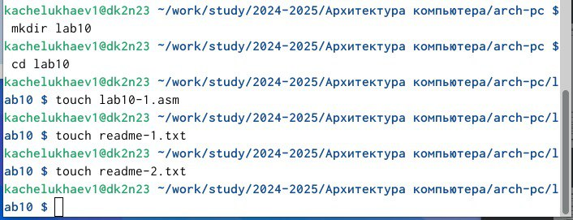
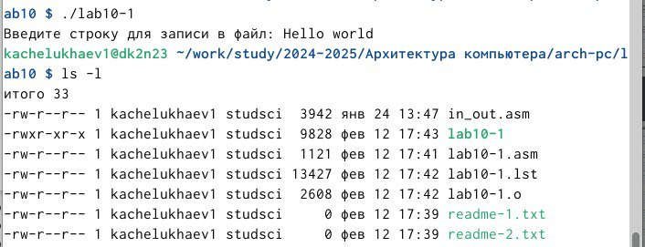
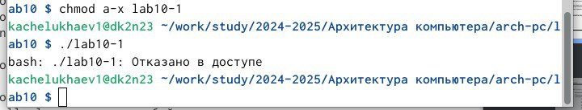
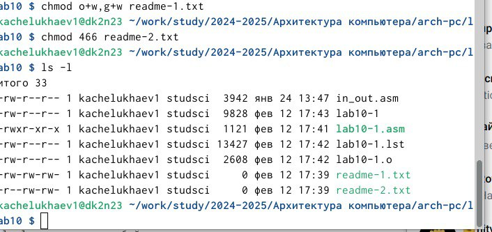
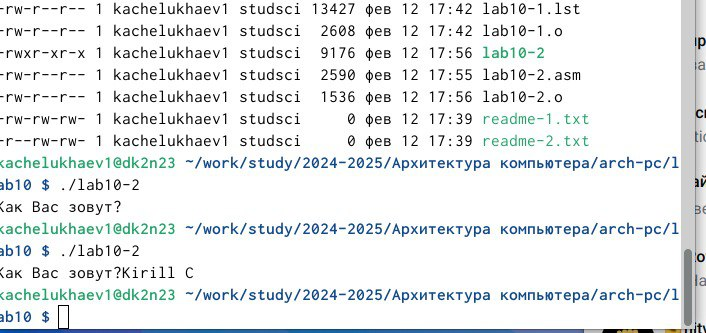

---
## Front matter
title: "Отчет по лабораторной работе №10"
subtitle: "Дисциплина: Архитектура компьютерa"
author: "Челухаeв Кирилл Александрович"

## Generic otions
lang: ru-RU
toc-title: "Содержание"

## Bibliography
bibliography: bib/cite.bib
csl: pandoc/csl/gost-r-7-0-5-2008-numeric.csl

## Pdf output format
toc: true # Table of contents
toc-depth: 2
lof: true # List of figures
lot: true # List of tables
fontsize: 12pt
linestretch: 1.5
papersize: a4
documentclass: scrreprt
## I18n polyglossia
polyglossia-lang:
  name: russian
  options:
	- spelling=modern
	- babelshorthands=true
polyglossia-otherlangs:
  name: english
## I18n babel
babel-lang: russian
babel-otherlangs: english
## Fonts
mainfont: IBM Plex Serif
romanfont: IBM Plex Serif
sansfont: IBM Plex Sans
monofont: IBM Plex Mono
mathfont: STIX Two Math
mainfontoptions: Ligatures=Common,Ligatures=TeX,Scale=0.94
romanfontoptions: Ligatures=Common,Ligatures=TeX,Scale=0.94
sansfontoptions: Ligatures=Common,Ligatures=TeX,Scale=MatchLowercase,Scale=0.94
monofontoptions: Scale=MatchLowercase,Scale=0.94,FakeStretch=0.9
mathfontoptions:
## Biblatex
biblatex: true
biblio-style: "gost-numeric"
biblatexoptions:
  - parentracker=true
  - backend=biber
  - hyperref=auto
  - language=auto
  - autolang=other*
  - citestyle=gost-numeric
## Pandoc-crossref LaTeX customization
figureTitle: "Рис."
tableTitle: "Таблица"
listingTitle: "Листинг"
lofTitle: "Список иллюстраций"
lotTitle: "Список таблиц"
lolTitle: "Листинги"
## Misc options
indent: true
header-includes:
  - \usepackage{indentfirst}
  - \usepackage{float} # keep figures where there are in the text
  - \floatplacement{figure}{H} # keep figures where there are in the text
---

# Цель работы

Приобретение навыков написания программ для работы с файлами

# Задание

1. Основное задание
2. Выполнение заданий для самостоятельной работы


# Теоретическое введение

ОС GNU/Linux является многопользовательской операционной системой. И для обеспечения защиты данных одного пользователя от действий других пользователей существуют
специальные механизмы разграничения доступа к файлам. Кроме ограничения доступа, данный механизм позволяет разрешить другим пользователям доступ данным для совместной
работы.
Права доступа определяют набор действий (чтение, запись, выполнение), разрешённых
для выполнения пользователям системы над файлами. Для каждого файла пользователь
может входить в одну из трех групп: владелец, член группы владельца, все остальные. Для
каждой из этих групп может быть установлен свой набор прав доступа. Владельцем файла
является его создатель. Для предоставления прав доступа другому пользователю или другой группе командой
полнение файла. В символьном представлении он имеет вид строк rwx, где вместо любого
символа может стоять дефис. Всего возможно 8 комбинаций, приведенных в таблице 10.1.
Буква означает наличие права (установлен в единицу второй бит триады r — чтение, первый
бит w — запись, нулевой бит х — исполнение), а дефис означает отсутствие права (нулевое
значение соответствующего бита). Также права доступа могут быть представлены как восьмеричное число. Так, права доступа rw- (чтение и запись, без исполнения) понимаются как
три двоичные цифры 110 или как восьмеричная цифра 6.
# Выполнение лабораторной работы 

##  Основное задание

Я создал каталог для программам лабораторной работы № 10, перешел в него и
создал файлы lab10-1.asm, readme-1.txt и readme-2.txt (рис. [-@fig:001]).

{#fig:001 width=70%}

Ввел в файл lab10-1.asm текст программы из листинга 10.1 (Программа записи в
файл сообщения). Создал исполняемый файл и проверил его работу. (рис. [-@fig:002]).

{#fig:002 width=70%}

С помощью команды chmod изменил права доступа к исполняемому файлу lab10-1,запретив его выполнение. (рис. [-@fig:003]).

{#fig:003 width=70%}

. В соответствии с вариантом в таблице 10.4 предоставить права доступа к файлу readme1.txt представленные в символьном виде, а для файла readme-2.txt – в двочном виде.
Проверить правильность выполнения с помощью команды ls -l. (рис. [-@fig:004]).

{#fig:004 width=70%}

## Выполнение заданий для самостоятельной работы

1. Напишите программу работающую по следующему алгоритму:
* Вывод приглашения “Как Вас зовут?”
* ввести с клавиатуры свои фамилию и имя
* создать файл с именем name.txt
* записать в файл сообщение “Меня зовут”
* дописать в файл строку введенную с клавиатуры
* закрыть файл

Я создал файл lab10-2.asm и написал в нес код программы (рис. [-@fig:005]).

{#fig:005 width=70%}

``` NASM
%include 'in_out.asm'

SECTION .data
    msg_ask: db "Как Вас зовут?", 0
    msg_hello: db "Меня зовут ", 0
    filename: db "name.txt", 0 ; Имя файла

SECTION .bss
    name_buffer: resb 256 ; Буфер для ввода имени (достаточно большой)

SECTION .text
    global _start

_start:
    ; ---- 1. Вывод приглашения ----
    mov eax, msg_ask
    call sprint

    ; ---- 2. Ввод имени ----
    mov ecx, name_buffer  ; Адрес буфера
    mov edx, 255        ; Максимальная длина (оставляем место для завершающего нуля)
    call sread

    ; ---- 3. Создание файла ----
    mov eax, 8            ; SYS_CREAT
    mov ebx, filename   ; Имя файла
    mov ecx, 0666o      ; Права доступа: rw-rw-rw- (octal)
   int 80h             ; Вызов системного вызова create
   mov esi, eax         ; Сохраняем файловый дескриптор

    ; ---- 4. Запись сообщения "Меня зовут" ----
    mov eax, msg_hello
    call slen             ; Вычисляем длину сообщения
    mov edx, eax          ; Длина сообщения
    mov eax, msg_hello
    mov ebx, esi          ; Файловый дескриптор
    mov ecx, eax
    mov eax, 4            ; SYS_WRITE
    int 80h              ; Вызов системного вызова write

    ; ---- 5. Дозапись введенного имени ----
    mov eax, name_buffer
    call slen             ; Вычисляем длину введенного имени
    mov edx, eax          ; Длина имени
    mov eax, name_buffer
    mov ebx, esi          ; Файловый дескриптор
    mov ecx, eax          ; Адрес имени
    mov eax, 4            ; SYS_WRITE
    int 80h              ; Вызов системного вызова write

    ; ---- 6. Закрытие файла ----
    mov eax, esi         ; Файловый дескриптор
    mov eax, 6            ; SYS_CLOSE
    int 80h              ; Вызов системного вызова close

    call quit           ; Завершение программы
```

# Выводы

Я приобрел навыки написания программ для работы с файлами

# Список литературы{.unnumbered}

::: {#refs}
:::
